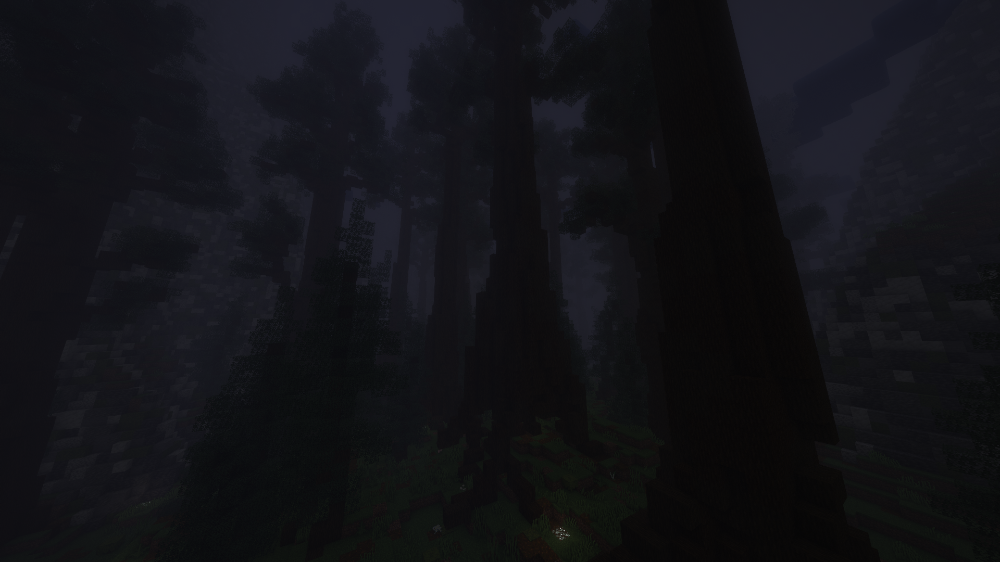

# 🪨 Down in the caves

Deep underground lies a dark and spacious cavern, it's quite an interesting sight to see. Let's get into finding and exploring the caves!

## Accessing the cavern region

The caves are accessed by tunneling below about **-y58**, at that point you should 'feel' the transition. You'll know it when you get there! Once you're in the cave region, you'll find that everywhere is still deepslate; to get to the actual caverns, continue digging to around **y270**. Remember, _don't dig straight down_!

_insert gif of me falling from the cavern ceiling because funny_

\_\_

## Mining

The caverns provide you will a resource that every player desires: **diamonds**! If you haven't noticed, no ores are generated in the map, rather, you will find '[hidden veins](#user-content-fn-1)[^1]' of ore that will show themselves randomly as you tunnel. Diamonds are _only_ found in the caves; you don't need to be in the caverns, just within the cave region.

_insert gif of finding cool resources in a hidden vein_

\_\_

## Biomes/Regions

Something else you may have tried was building a nether portal and finding it doesn't work. Turns out, the Nether has migrated to the caverns! There are currently 3 (?) biomes in the caverns: forest, 'nether,' and frozen (?). You can find each by exploring, but the largest region is covered by forest.

### Forest

Resources of interest: Variety of wood, berries, lush cave materials, shroom blocks

It has trees. Oh and there's a nice river too! The forest's main feature is that it's landscape is packed to the brim with wood! The roof is also covered in materials you'd find in a lush cave, so grab some of those if you need too. There are a couple sub-regions of the forest, like your usual spruce and dark oak, and some more unique ones like mushroom forest. This is a great place to grind your woodcutting stats, but do note that mobs will be spawning everywhere; there is almost no natural light on the cavern floor, so maybe you'll be fighting more than deforesting.&#x20;

<figure><figcaption>
what a nice forest i do hope mobs will not attack me at any given moment
</figcaption></figure>

### 'Nether'

Resources of interest: Magma block, lava, decoratives (blackstone, basalt, etc)

Not quite the Nether, I call this biome the 'Nether' (so creative!). This biome is a more mountainous and spacious nether-like region. It's quite the sight, there's hilly terrain, lava pools, ashen trees (which are really just acacia), and more! Currently, netherite is unobtainable, even through mining in this region. You may want to visit here if you want lava, especially if you're creating steel. Additionally, there are some nice blocks like blackstone if you're into decorating.&#x20;

[^1]: Hidden veins will do 1 of 2 things:

    * Randomly replace the surrounding stone with a couple ores.
    * Give you some common materials (sand, copper ore, gravel, etc.)
